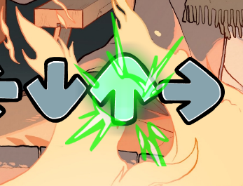

# HaxeFlixel Window Transparency

This repo shows how to make your HaxeFlixel window to be transparent without getting those black pixels on semi transparent pixels.


 
> [!NOTE]
> This method is Windows only.

## Setup
1. Copy and import [FlxWindowUtil.hx](../FlxWindowUtil.hx) into your project's source folder.
2. In your `Project.xml`, find the `<window>` tag and set `background="null"`:
   ```xml
   <window width="640" height="480" fps="60" background="null" hardware="true" vsync="false" />
   ```

## Usage
```hx
// enable transparency
FlxWindowUtil.setTransparency(true)
// disable transparency
FlxWindowUtil.setTransparency(false)
```

## Credits
Inspired by [Transparent-and-MultiWindow-FNF](https://github.com/duckiewhy/Transparent-and-MultiWindow-FNF) by [duckiewhy](https://github.com/duckiewhy).

I made this because their method didn't work on my device and the black pixels kinda triggering me, so I found a way to make it work.

If you use this, a credit would be appreciated. :]
